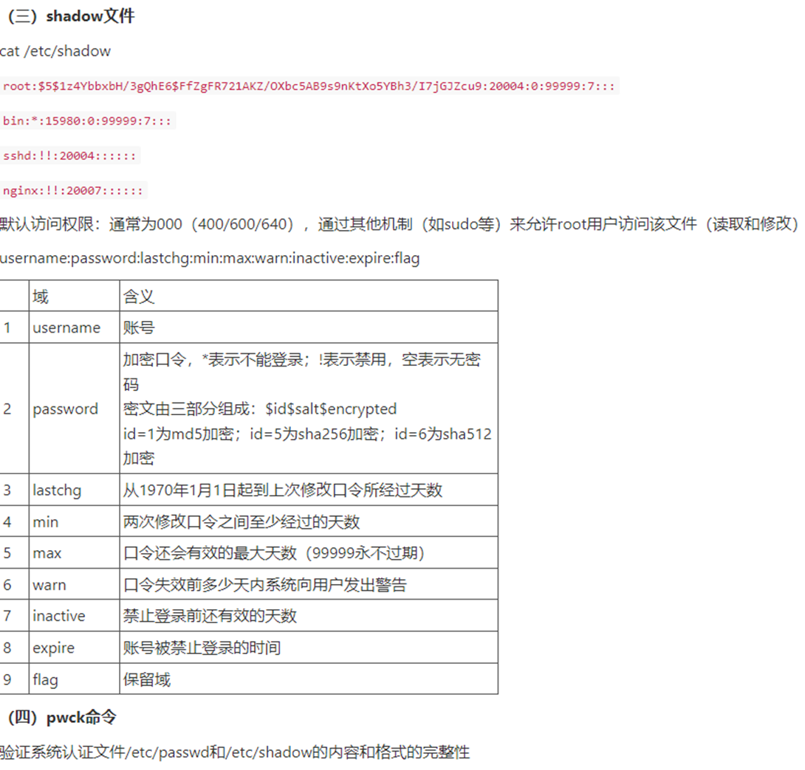

# 安全测试-知识速查

🚀🚀覆盖大部分安全测试常用知识🚀🚀

* * *

* ### 💻 法律法规速查表
| **法律法规**        | **发布机关**                           | **颁布时间**    | **实施时间**   | **说明**                                            |
|-----------------|------------------------------------|-------------|------------|---------------------------------------------------|
| 国家安全法           | 全国人大                               | 2015年7月1日   | 2015年7月1日  | 建国以来在国家安全方面制定的第一部专门法律                             |
| 网络安全法           | 全国人大                               | 2016年11月7日  | 2017年6月1日  | 我国首部网络安全领域的法律，是保障网络安全的基本法                         |
| 密码法             | 全国人大                               | 2019年10月1日  | 2020年1月1日  | 将规范密码应用和管理，促进密码事业发展，保障网络与信息安全，提出了国家对密码实行分类管理      |
| 数据安全法           | 全国人大                               | 2021年6月10日  | 2021年9月1日  | 我国关于数据安全的首部律法，是继网络安全法提出数据的概念后，国家在数据安全立法层面的一个重大里程碑 |
| 关键信息基础设施安全保护条例  | 国务院                                | 2021年4月27日  | 2021年9月1日  | 明确重点行业和领域重要网络设施、信息系统属于关键信息基础设施                    |
| 个人信息保护法         | 全国人大                               | 2021年8月20日  | 2021年11月1日 | 保障个人信息权益的基本法                                      |
| 网络安全审查办法        | 国家网信办、发改委、工信部等13部门                 | 2021年12月28日 | 2022年2月15日 | 将网络平台运营者开展数据处理活动影响或可能影响国家安全等情形纳入网络安全审查            |
| 生成式人工智能服务管理暂行办法 | 国家网信办、国家发改委、教育部、科技部、工信部、公安部、国家广电总局 | 2023年7月13日  | 2023年8月15日 | 保障生成式人工智能的健康发展和规范应用                               |
| 互联网政务应用安全管理规定   | 中央网信办、中央编办、工信部、公安部                 | 2024年2月19日  | 2024年7月1日  | 促进政务应用相关主体加强数据安全管理，提升数据合规水平，推动数据要素的高效配置和合理利用      |
| 网络暴力信息治理规定      | 国家网信办、公安部、文旅部、国家广电总局               | 2023年12月25日 | 2024年8月1日  | 强化网络暴力信息的治理，营造良好的网络生态，保障公民的合法权益，维护社会公共利益。         |

* ### 💻 常见协议速查表

| **缩写**  | **全称**                              | **中文名**              | **介绍**                                                                            |
|---------|-------------------------------------|----------------------|-----------------------------------------------------------------------------------|
| TCP     | Transmission Control Protocol       | 传输控制协议               | TCP 是一种面向连接的、可靠的、基于字节流的传输层通信协议，用于在不可靠的互联网络上提供可靠的端到端的数据流传输服务。                      |
| IP      | Internet Protocol                   | 互联网协议                | IP 协议定义了数据应该如何在网络之间传输（路由选择），以及如何封装（分组）。它是构成Internet的核心协议。                         |
| HTTP    | HyperText Transfer Protocol         | 超文本传输协议              | HTTP 是一种用于分布式、协作式和超媒体信息系统的应用层协议，主要用于网页浏览器和服务器之间的数据传输。                             |
| HTTPS   | HyperText Transfer Protocol Secure  | 安全超文本传输协议            | HTTPS 是 HTTP 的安全版本，使用 SSL/TLS 协议来加密 HTTP 数据，以保护数据传输的安全性。                          |
| DNS     | Domain Name System                  | 域名系统                 | DNS 是一个分布式数据库系统，用于将人类可读的域名转换为计算机可处理的IP地址。                                         |
| FTP     | File Transfer Protocol              | 文件传输协议               | FTP 是一种用于在网络上进行文件传输的应用层协议，支持基本的文件上传和下载功能。                                         |
| SMTP    | Simple Mail Transfer Protocol       | 简单邮件传输协议             | SMTP 是一种提供可靠且有效发送电子邮件的方法，用于从发件人到邮件服务器的邮件传输。                                       |
| POP3    | Post Office Protocol Version 3      | 邮局协议第三版              | POP3 是一种邮件协议，用于从邮件服务器检索电子邮件并下载到客户端应用程序，适合单设备。                                     |
| IMAP    | Internet Message Access Protocol    | 互联网消息访问协议            | IMAP 是一种邮件协议，允许用户从邮件服务器检索邮件，同时支持邮件在服务器上的管理，适合多设备。                                 |
| DHKE    | Diffie-Hellman Key Exchange         | Diffie-Hellman密钥交换协议 | DHKE一种通过公共通道安全地交换加密密钥的数学方法，用于解决能够安全的通信之前，通信双方约定一个共享的密钥的问题（密钥配送问题）                 |
| SSL     | Secure Sockets Layer                | 套接层安全协议              | SSL 是一种用于建立互联网上信息安全链接的标准安全技术，现已演变为 TLS。                                           |
| TLS     | Transport Layer Security            | 传输层安全协议              | TLS 是 SSL 的继任者，用于加密应用程序层协议提供的通信，以防止窃听、篡改或消息伪造。                                    |
| Telnet  | Telnet                              | 远程终端协议               | 用于在客户端和服务器之间进行双向文本通信。因传输都为明文而弃用，                                                  |
| Stelnet | Secure Telnet                       | 安全远程终端协议             | STelnet 是专门针对 Telnet 协议的安全增强版本，主要用于远程终端连接（老旧设备），但不如SSH。STelnet = Telnet + SSL/TLS |
| SSH     | Secure Shell                        | 安全外壳协议               | SSH 为数据通信提供了一个安全的环境，常用于远程登录、文件传输和其他网络服务的安全传输，用于替代Telnet。SSH1已弃用，目前使用SSH2.         |
| DHCP    | Dynamic Host Configuration Protocol | 动态主机配置协议             | DHCP 是一种简化网络主机配置管理的协议，允许自动分配IP地址和其他网络配置参数。                                        |
| ARP     | Address Resolution Protocol         | 地址解析协议               | ARP 用于解析 IP 地址到对应的 MAC 地址，以便在同一物理网络内的设备间进行通信。                                     |
| ICMP    | Internet Control Message Protocol   | 互联网控制消息协议            | ICMP 用于传递错误消息和其他控制信息，帮助网络设备诊断网络问题。                                                |
| EGP     | Exterior Gateway Protocol           | 外部网关协议               | EGP是AS之间使用的路由协议，由于EGP存在很多的局限性，目前使用边界网关协议（BGP）替代。                                  |
| BGP     | Border Gateway Protocol             | 边界网关协议               | BGP是一种增强的路径矢量路由协议（替代EGP），同时BGP是拥有丰富的策略控制技术的外部网关协议。多运行于AS与AS之间。                    |
| PGP     | Pretty Good Privacy                 | 优良保密协议               | 一套用于消息加密、验证的应用程序，采用IDEA的散列算法作为加密与验证之用                                             |

**常见协议开放端口表**

| **协议**  | **端口号** | **备注** |
|---------|---------|--------|
| HTTP    | 80      |        |
| HTTPS   | 443     |        |
| FTP（控制） | 21      |        |
| FTP（数据） | 20      |        |
| SMTP    | 25      |        |
| DNS     | 53      |        |
| SSH     | 22      |        |
| Telnet  | 23      |        |
| POP3    | 110     |        |
| IMAP    | 143     |        |
| NTP     | 123     |        |
| SMB     | 445     | 永恒之蓝   |

* ### 💻 常见加密算法速查表

**雪崩效应=加密方式（分组加密+消息摘要）**

| **加密算法**   | **加密类型** | **加密方式**       | **加密长度**     | **主密钥长度**      | **子密钥长度** | **输出长度**  | **特点**                                                          |
|------------|----------|----------------|--------------|----------------|-----------|-----------|-----------------------------------------------------------------|
| DES        | 对称加密     | 分组加密           | 64位          | 56位            | 48位       |           | 早期广泛使用的对称加密算法，现在被认为不够安全。                                        |
| 3DES（TDES） | 对称加密     | 分组加密           | 64位          | 112位、168位      |           |           | 通过多次使用DES算法增强安全性。加密过程：K1加K2解K3加。解密过程：K3解K2加K1解                  |
| IDEA       | 对称加密     | 分组加密           | 64位          | 128位           |           |           | 在PGP中应用，可进行加解密。                                                 |
| AES        | 对称加密     | 分组加密           | 128位         | 128位、192位、256位 |           |           | 替代DES，目前最流行的对称加密算法，提供多种密钥长度。                                    |
| SM1        | 对称加密     | 分组加密           | 128位         | 128位           |           |           | 中国的商用密码算法，用于芯片加密。                                               |
| SM4        | 对称加密     | 分组加密           | 128位         | 128位           |           |           | 类似于AES，用于国内加密需求。                                                |
| SM7        | 对称加密     | 分组加密           | 128位         | 128位           |           |           | 用于非接触式IC卡，应用包括身份识别类应用\(门禁卡、工作证、参赛证\)                            |
| ZUC        | 对称加密     | 流密码            | 流式加密，无固定加密长度 | 128位           |           | 32位的密钥字流  | 中国的国家标准流密码算法，用于4G、5G通信安全。                                       |
| RC4        | 对称加密     | 流密码            | 流式加密，无固定加密长度 |                |           |           | 流密码算法，用于WEP和TLS协议中。                                             |
| RSA        | 非对称加密    | 模数指数运算         | 变长（由密钥长度决定）  | 可变（推荐1024位以上）  |           |           | 基于大整数因子分解难题，用于安全数据传输。SSH、OpenPGP、S/MIME、SSL/TLS 协议依赖其进行加密和数字签名。 |
| ECC        | 非对称加密    | 基于椭圆曲线的离散对数问题  | 变长（由密钥长度决定）  |                |           |           | 全称Elliptic Curve Cryptography，提供与RSA相比更高效的安全性。                  |
| Elgamal    | 非对称加密    | 基于有限域上的离散对数问题  | 变长（由密钥长度决定）  |                |           |           | 比DH好的密钥交换算法                                                     |
| DH         | 非对称加密    | 基于有限域上的离散对数问题  | 变长（由密钥长度决定）  |                |           |           | Diffie\-Hellman 密钥交换算法允许两方在不安全的通道上安全地协商共享密钥                     |
| SM2        | 非对称加密    | 基于椭圆曲线上的离散对数问题 | 变长（由密钥长度决定）  | 可变（推荐256位以上）   |           |           | 类似于RSA，用于公钥加密、数字签名、密钥交换。                                        |
| SM9        | 非对称加密    | 标识运算           | 变长（由密钥长度决定）  | 可变（推荐256位以上）   |           |           | 标识密码将用户的标识作为公钥，主要用于用户的身份认证                                      |
| MD5        | 散列算法     | 消息摘要           | 512          |                |           | 128       | 快速且广泛应用，但由于存在碰撞攻击，不再推荐用于安全应用。                                   |
| SHA        | 散列算法     | 消息摘要           |              |                |           | SHA1\-160 | SHA家族有SHA\-1,SHA\-2,SHA\-3。 SHA\-1已弃用                           |
| SM3        | 散列算法     | 消息摘要           | 512          |                |           | 256       | 中国的国家标准散列算法（杂凑算法），用于数据完整性校验。如数字签名和验证                            |

* ### 💻 Linux安全基础

**Linux重点符号**

| **符号** | **作用** | **说明**            | **示例**                             |
|--------|--------|-------------------|------------------------------------|
| ~      | 目录符    | 用户home目录          | cd ~                               |
| \.     | 目录符    | 当前目录              | cd \.                              |
| \.\.   | 目录符    | 上级目录              | cd \.\.                            |
| \#     | 提示符    | root用户命令行输入位置     | \[root@localhost ~\]\#             |
| $      | 提示符    | 普通用户命令行输入位置       | \[test@localhost ~\]$              |
| /      | 目录符    | 代表目录              | cd /                               |
| \\     | 转义符    | 用于转义特殊字符          |                                    |
| \|     | 管道     | 前命令输出作为后命令输入      | ps \-aux \| grep java              |
| ;      | 分隔符    | 连续命令分隔符           | mkdir a;touch a\.txt;mv a\.txt a/  |
| &&     | 逻辑与    | 按先后顺序执行命令         | make && make install               |
| \|\|   | 逻辑或    | 前命令为真，后面命令不执行；    | make \|\| echo "make failed"       |
|        |        | 前命令为假，后面命令执行      |                                    |
| \!     | 逻辑非    | 取反                |                                    |
| ;;     | 分隔符    | 总是执行下一个命令         | touch a\.txt;;mv a\.txt a/         |
| &      | 后台     | 某命令放入后台工作         | cp \-R home/dir/ backup/dir/ &     |
| >      | 重定向符   | 覆写：目标不存在则创建       | ls > /home/a\.txt                  |
|        |        |                   | ls 1> /home/a\.txt                 |
| >>     | 重定向符   | 追加：目标不存在则创建       | ls >> /home/a\.txt                 |
| &>     | 组合符    | 是“1&2>”的缩写        | ls &> out\.log                     |
| >&     | 组合符    | 连接重定向符            | nohup sh a\.sh > nohup\.log 2>&1 & |
|        |        | 0标准输入 1标准输出 2标准错误 |                                    |

**Linux重点目录**

| **目录名** | **描述**                       |
|---------|------------------------------|
| bin     | bin\-> usr/bin二进制命令目录        |
| boot    | 内核及引导系统程序目录                  |
| dev     | 所有设备文件（如磁盘、光驱等）目录            |
| etc     | 配置文件默认路径、服务启动命令目录            |
| home    | 用户家目录，root用户为/root           |
| lib     | lib→usr/lib 32位库文件目录         |
| lib64   | lib64→usr/lib64 64位库文件存放目录   |
| media   | 媒体文件存放目录                     |
| mnt     | 临时挂载设备目录                     |
| opt     | 自定义软件安装存放目录                  |
| proc    | 进程及内核信息存放目录                  |
| root    | root用户家目录                    |
| run     | 系统运行时产生临时文件，存放目录             |
| sbin    | sbin \-> usr/sbin 系统管理命令存放目录 |
| srv     | 服务启动之后需要访问的数据目录              |
| sys     | 系统使用目录                       |
| tmp     | 临时文件目录                       |
| usr     | 系统命令和帮助文件目录                  |
| var     | 存放内容易变文件的目录                  |

**Linux配置文件**

| **文件名**                                     | **描述**                 |
|---------------------------------------------|------------------------|
| /etc/hosts                                  | 包含IP地址和主机名的映射，用于本地解析   |
| /etc/hosts\.equiv和$HOME/\.rhosts            | 设置受信任（不需提供口令）的计算机和用户   |
| /etc/fstab                                  | 列出系统启动时要挂载的文件系统        |
| /etc/sysconfig                              | 包含各种服务和系统的配置文件         |
| /etc/resolv\.conf                           | 设置DNS域名解析服务器的信息        |
| /etc/sysconfig/networkscripts或/etc/network/ | 网络接口的配置文件              |
| /etc/passwd                                 | 存储用户账户信息               |
| /etc/group                                  | 存储群组信息                 |
| /etc/shadow                                 | 存储用户密码的加密版本            |
| /etc/selinux                                | SELinux策略配置文件          |
| /etc/firewalld                              | Firewalld防火墙的配置文件      |
| /etc/rc\.d                                  | 启动和关闭脚本的目录             |
| /etc/init\.d 或/etc/systemd/system           | 服务启动脚本的目录              |
| /etc/pam\.d                                 | PAM模块的配置文件目录           |
| /etc/services                               | 网络服务名称及其端口号和协议对照       |
| /etc/sudoers                                | 配置sudo命令，定义用户以何种权限运行命令 |
| /etc/httpd                                  | Apache Web服务器的配置文件目录   |
| /etc/ssh                                    | SSH服务的配置文件目录           |

**Linux重要文件详情**

**Linux 安全领域常用命令**
1. 用户和权限管理

| **命令**                  | **描述**                          |
|-------------------------|---------------------------------|
| who                     | 显示登录用户信息                        |
| whoami                  | 显示当前用户的用户名。                     |
| id                      | 显示当前用户的 UID、GID 和所属组。           |
| sudo                    | 以超级用户或其他用户身份执行命令。               |
| su                      | 切换用户身份。                         |
| useradd                 | 添加新用户。                          |
| userdel                 | 删除用户。                           |
| usermod                 | 修改用户 usermod \-l dog cat  把猫改成狗 |
| passwd                  | 更改用户密码。                         |
| groupadd                | 添加新组。                           |
| groupdel                | 删除组。                            |
| chown                   | 更改文件或目录的所有者。                    |
| chgrp                   | 更改文件或目录的组。                      |
| chmod                   | 更改文件或目录的权限。                     |
| systemctl restartt sshd | 重启ssh服务                         |

2. 文件和目录管理

| **命令**          | **描述**                           |
|-----------------|----------------------------------|
| ls \-l          | 列出文件和目录的详细信息，包括权限、所有者、组、大小和修改时间。 |
| find            | 查找文件和目录。                         |
| stat            | 显示文件或文件系统的状态信息。                  |
| cat /etc/passwd | 查看用户账户信息。                        |
| cat /etc/group  | 查看组信息。                           |

3. 系统和服务管理

| **命令**         | **描述**                               |
|----------------|--------------------------------------|
| ps aux         | 显示所有正在运行的进程。                         |
| top            | 显示系统资源使用情况和正在运行的进程。                  |
| htop           | 一个交互式的进程查看器。                         |
| netstat \-tuln | 显示网络连接、路由表、接口统计等信息。                  |
| ss \-tuln      | 类似于 netstat，但更高效。                    |
| systemctl      | 管理系统服务和启动项。                          |
| service        | 启动、停止、重启服务。                          |
| iptables       | 配置 IP 防火墙规则。                         |
| ufw            | Uncomplicated Firewall，一个简单的防火墙管理工具。 |

4. 日志和审计

| **命令**                   | **描述**                |
|--------------------------|-----------------------|
| dmesg                    | 显示内核环缓冲区的内容。          |
| journalctl               | 查看系统日志。               |
| tail \-f /var/log/syslog | 实时查看系统日志文件。           |
| auditd                   | 审计守护进程，用于记录系统调用和文件访问。 |
| ausearch                 | 搜索审计日志。               |

5. 网络安全

| **命令**   | **描述**                        |
|----------|-------------------------------|
| ifconfig | 显示和配置网络接口（在某些发行版中已被 ip 命令取代）。 |
| ip a     | 显示网络接口信息。                     |
| ip route | 显示和配置路由表。                     |
| nmap     | 网络扫描和端口扫描工具。                  |
| tcpdump  | 抓取和分析网络流量。                    |
| ss       | 显示套接字统计信息。                    |
| fail2ban | 防止暴力破解攻击的工具。                  |

6. 加密和认证

| **命令**     | **描述**                       |
|------------|------------------------------|
| openssl    | 加密和证书管理工具。                   |
| ssh-keygen | 生成 SSH 密钥对。                  |
| ssh-copy-id | 将公钥复制到远程主机。                  |
| gpg        | GNU Privacy Guard，用于加密和签名文件。 |

7. 系统加固

| **命令**           | **描述**                    |
|------------------|---------------------------|
| sestatus         | 显示 SELinux 状态。            |
| setenforce       | 临时启用或禁用 SELinux。          |
| apparmor\_status | 显示 AppArmor 状态。           |
| chkrootkit       | 检查系统是否被 rootkit 感染。       |
| rkhunter         | 另一个检查系统是否被 rootkit 感染的工具。 |

8. 其它常用命令

* ### 💻 WINDOWS安全基础
**Windows 常用安全程序**

| **程序**                | **描述**        |
|-----------------------|---------------|
| 事件查看器                 | eventvwr      |
| 本机用户和组                | lusrmgr\.msc  |
| 本地安全策略（账户策略、本地策略）     | secpol\.msc   |
| windows服务             | services\.msc |
| 防火墙配置\(高级设置\-出入站规则等\) | firewall\.cpl |
| 系统配置（启动项管理）           | msconfig      |
| 任务管理器                 | taskmgr       |
| 注册表（取消自动分享服务）         | regedit       |
| 本地组策略编辑器              | gpedit\.msc   |
| 资源监视器                 | resmon        |
| 系统信息（软硬件）             | msinfo32      |
| 访问系统属性                | sysdm\.cpl    |
| 任务计划程序                | taskschd\.msc |

**Windows重点目录**

| **目录路径**                                      | **描述**                                                                                   |
|-----------------------------------------------|------------------------------------------------------------------------------------------|
| C:\\Windows\\Logs                             | 存系统日志文件，记录了系统运行的各种事件和错误信息。可以通过查看这些日志来监控系统安全状况。                                           |
| C:\\Windows\\security                         | 存放系统安全相关的文件和数据，如安全策略、审计日志等。这些文件对系统安全至关重要，应严格保护。                                          |
| C:\\Windows\\System32                         | 存放系统的核心文件和可执行文件，包括许多重要的安全工具和服务。                                                          |
| C:\\Windows\\System32\\config                 | 存放系统注册表的备份文件。注册表是系统配置的核心，保护这些文件可以防止系统配置被篡改。                                              |
| C:\\Windows\\System32\\config\\SAM            | SAM \(Security Accounts Manager\) 文件：这个文件包含了本地用户的账户信息，包括密码哈希值。但是，这个文件在系统运行时是被保护的，无法直接访问。 |
| C:\\Windows\\System32\\drivers                | 存设备驱动程序文件。驱动程序对系统稳定性影响很大，应确保这些文件的完整性和安全性。                                                |
| C:\\Program Files 和 C:\\Program Files \(x86\) | 存安装的应用程序及其相关文件。应确保这些目录下的文件不被未授权修改。                                                       |
| C:\\Users\\<用户名>\\AppData                     | 存用户特定的应用程序数据，包括本地设置、漫游设置和临时文件。特别是 Local 和 Roaming 子目录，可能包含敏感信息，需要保护。                     |
| C:\\Windows\\Temp                             | 临时文件目录，系统和应用程序会在此创建临时文件。需要定期清理，防止恶意软件利用临时文件进行攻击。                                         |
| C:\\Windows\\SoftwareDistribution             | 存Windows Update下载的更新文件。保持这个目录的干净和安全有助于确保系统及时获得安全更新。                                      |
| C:\\Windows\\SysWOW64                         | 类似于 System32，但专门用于32位应用程序在64位Windows系统上的运行。同样需要保护，防止未授权访问和修改。                            |

**Windows cmd命令**

| **命令**                        | **作用**  | **示例**                    | **对比Linux** |
|-------------------------------|---------|---------------------------|-------------|
| cd                            | 进入目录    |                           | cd          |
| dir                           | 列目录     |                           | ls          |
| md                            | 创建目录    |                           | mkdir       |
| rd                            | 删除目录    |                           | rmdir & rm  |
| ipconfig                      | 本机IP    | ipconfig /flushdns        | ifconfig    |
| cls                           | 清屏      |                           | clear       |
| copy                          | 复制文件    |                           | cp          |
| move                          | 移动文件    |                           | mv          |
| del                           | 删除文件    |                           | rm          |
| ping                          | 连通测试    |                           | ping        |
| taskkill                      | 中止进程    |                           | kill        |
| netstat                       | 网络连接    |                           | netstat     |
| find                          | 查询      |                           | find        |
| tracert                       | 跟踪路由    |                           | traceroute  |
| net user                      | 查看用户列表  |                           |             |
| net user 用户名 密码 /add          | 新增用户    | 新增用户名带$为隐藏用户，只有图形界面、注册表可见 |             |
| net user 用户名 /delete          | 删除用户    |                           |             |
| net user 用户名 新密码              | 修改用户密码  |                           |             |
| net localgroup                | 查看用户组   |                           |             |
| net localgroup 组名 /add        | 新增用户组   |                           |             |
| net localgroup 组名 /delete     | 删除用户组   |                           |             |
| net localgroup 组名 用户名 /add    | 用户组添加用户 |                           |             |
| net localgroup 组名 用户名 /delete | 用户组删除用户 |                           |             |

* ### 💻 Wireshark
**wireshark过滤规则**

| **作用**        | **规则**                                                    |
|---------------|-----------------------------------------------------------|
| 按 IP 地址过滤：    | ip\.addr == 192\.168\.1\.1                                |
|               | ip\.src == 192\.168\.1\.1                                 |
|               | ip\.dst == 192\.168\.1\.1                                 |
| 按字符串内容过滤：     | http\.request\.uri contains "login"                       |
| 按数据包长度过滤：     | frame\.len > 1000                                         |
| 按 DNS 查询名称过滤： | dns\.qry\.name == "example\.com"                          |
| 按 HTTP 方法过滤：  | http\.request\.method == "POST"                           |
| 按端口号过滤：       | tcp\.port == 80                                           |
|               | udp\.port == 53                                           |
|               | tcp\.srcport == 80                                        |
|               | tcp\.dstport == 80                                        |
| 按 MAC 地址过滤：   | eth\.addr == 00:11:22:33:44:55                            |
|               | eth\.src == 00:11:22:33:44:55                             |
|               | eth\.dst == 00:11:22:33:44:55                             |
| wireshark组合过滤 | tcp and ip\.addr == 192\.168\.1\.1 and tcp\.port == 22    |
|               | ip\.src == 192\.168\.1\.1 and   ip\.dst == 192\.168\.1\.2 |
|               | ip\.dst == 192\.168\.0\.1 and tcp\.dstport == 9002        |

* ### 💻 移动安全相关
**安卓系统4大组件**

| **组件**             | ****  | **作用**                                                                                       | **安全威胁**               |
|--------------------|-------|----------------------------------------------------------------------------------------------|------------------------|
| Activity           | 活动    | 核心组件，表示应用的一个单一屏幕，是用户与应用交互的主界面。每个 Activity 提供一个窗口，用于绘制界面和接收与用户的交互事件。每个 Activity 都是一个独立的界面。    | 越权：敏感页面需要验证用户身份        |
|                    |       |                                                                                              | 拒绝服务崩溃：接受Intent传输的畸形数据 |
|                    |       |                                                                                              | 界面劫持                   |
| Service            | 服务    | 可以在后台执行长时间运行的任务而不需提供用户界面（即使用户已离开应用）。用来处理不需要与用户交互而需要长期运行的操作。分为前台服务（显示持续通知）和后台服务（应用不在屏幕显示时执行）。 | 提权                     |
|                    |       |                                                                                              | service劫持              |
|                    |       |                                                                                              | 消息伪造                   |
|                    |       |                                                                                              | 拒绝服务                   |
| Broadcast Receiver | 广播接收器 | 用来处理来自系统或应用发出的广播通知。可以对设备启动完成、电池电量变化、短信接收等系统事件做出响应，也可以接收应用自定义的广播消息。                           | 消息伪造和拒绝服务              |
|                    |       |                                                                                              | 拒绝服务                   |
| Content Provider   | 内容提供器 | 用于在不同应用程序之间共享数据。提供了一种封装数据的方式，并通过一套标准 API 在应用之间进行数据访问。某应用可以允许其他应用访问其数据，而不需要直接访问底层数据库或文件系统。    | 敏感信息泄露                 |
|                    |       |                                                                                              | SQl注入                  |
|                    |       |                                                                                              | 目录遍历                   |
|                    |       |                                                                                              | 数据备份                   |

**安卓安全策略**

| **位置**  | **安全措施**                      |
|---------|-------------------------------|
| 应用程序层   | 权限声明机制                        |
| 应用程序框架层 | 应用程序签名机制                      |
| 系统运行库层  | 安全沙箱、网络加密通信SSL                |
| 内核层     | 内核安全：文件系统安全、地址空间布局随机化、SELinux |

**安卓权限组**

| **系统定义权限组** | **** |
|-------------|------|
| CALENDAR    | 日历   |
| CAMERA      | 照相机  |
| CONTACTS    | 联络   |
| LOCATION    | 地点   |
| MICROPHONE  | 麦克风  |
| PHONE       | 电话   |
| SENSORS     | 传感器  |
| SMS         | 短讯服务 |
| STORAGE     | 存储器  |

**安卓数据储存方式**

| **移动终端数据储存方式**    |
|-------------------|
| 文件储存              |
| SQLite数据库         |
| SharedPreferences |
| ContentProvider   |

* ### 💻 iptables防火墙

| **表类型** | **表作用** | **链类型**     |
|---------|---------|-------------|
| filter  | 包过滤（默认） | INPUT       |
|         |         | FORWARD     |
|         |         | OUTPUT      |
| nat     | 网络地址转换  | PREROUTING  |
|         |         | POSTROUTING |
|         |         | OUTPUT      |
| mangle  | 包修改重构   | 都有          |
| raw     | 数据跟踪    | PREROUTING  |
|         |         | OUTPUT      |

| **可操作类型** |
|-----------|
| ACCEPT    |
| REJECT    |
| DROP      |
| LOG       |

**常用表链配置命令**

| **功能**    | **命令名**  | **表名**     | **指定协议** | **指定链**         | **指定源地址、端口**                                       | **指定目标地址、端口**                                       | **指定操作**         |
|-----------|----------|------------|----------|-----------------|----------------------------------------------------|-----------------------------------------------------|------------------|
| 设置默认规则    | iptables | \-t filter |          |                 |                                                    |                                                     | \-P INPUT ACCEPT |
| 查询        | iptables | \-t filter |          |                 |                                                    |                                                     | \-nvxL \-\-line  |
| 增加（末尾）    | iptables | \-t filter | \-p tcp  | \-A INPUT       | \-s 192\.168\.0\.1 \-\-sport 22:25                 | \-d 192\.168\.0\.2 \-\-dport 22                     | \-j ACCEPT       |
| 增加（插入）    | iptables | \-t filter | \-p tcp  | \-I INPUT 1（序号） | \-s 192\.168\.0\.1 \-\-sport 22                    | \-d 192\.168\.0\.2 \-\-dport 22                     | \-j ACCEPT       |
| 增加（多端口）   | iptables | \-t filter | \-p tcp  | \-A INPUT       | \-s 192\.168\.0\.1 \-m multiport \-\-sport 80,443  | \-d 192\.168\.0\.2  \-m multiport \-\-dport 80,443  | \-j ACCEPT       |
| 删除（指定规则）  | iptables | \-t filter |          | \-D INPUT 1（序号） |                                                    |                                                     |                  |
| 删除（清空链规则） | iptables | \-t filter |          | \-F INPUT       |                                                    |                                                     |                  |
| 修改        | iptables | \-t filter |          | \-R INPUT 1（序号） | \-s 192\.168\.0\.1 \-\-sport 22                    | \-d 192\.168\.0\.2 \-\-dport 22                     | \-j ACCEPT       |

* ### 💻 日志审计
**拒绝服务攻击**
smurf攻击

死亡之Ping

SYN Flood

ACK Flood
跟SYN Flood同理

TCPLAND
TCPLAND（Local Area Network Denial Attack）攻击同样利用了TCP的三步握手过程。通过向目标系统发送TCP SYN报文而完成对目标系统的攻击。与正常的TCP SYN报文不同的是，LAND攻击报文的源IP地址和目的IP地址相同，都是目标系统的IP地址。因此，目标系统接收到这个SYN报文后，就会向该报文的源地址（目标系统本身）发送一个ACK报文，并建立一个TCP连接，即目标系统自身建立连接。如果攻击者发送了足够多的SYN报文，则目标系统的资源就会耗尽，最终造成DoS攻击。

UDP Flood

木马攻击（C&C通信）

* ### 💻 IDS-入侵检测系统

| **IDS分类** | ****                    |
|-----------|-------------------------|
| 基于主机的IDS  | Swatch、Tripwire、网页防篡改系统 |
| 基于网络的IDS  | snort、其它                |

**Snort**

| **工作方式** | **嗅探** |
|----------|--------|
|          | 包记录    |
|          | 网络入侵检测 |

| **规则**     | ****                                                |
|------------|-----------------------------------------------------|
| 规则头        | 规则操作（action）、协议（protocol）、源地址和目的IP地址及掩码、源地址和目的端口号信息 |
| 规则选项（引擎核心） | 报警消息、被检查网络包的部分信息及规则应采取动作                            |

详情：

* ### 💻 密码学
**RSA**
RSA数字签名保证哪些安全基本目标？完整性	不可否认性	真实性

***RSA加解密的过程***

| **公钥**  | **私钥**  | **明文** | **密文** | **模数** |
|---------|---------|--------|--------|--------|
| \(N,E\) | \(N,D\) | M      | C      | N      |

先用 E\D 幂运算，幂运算结果用N求余=加解密的结果。

***制作公\私钥（生成密钥对）***

| **加解密公式**                                 | ****          |
|-------------------------------------------|---------------|
| \(明文或密文\)^（E或D）/N的余数，明文长度必须小于N，否则解密结果不正确。 |               |
| 加密                                        | C = M^E mod N |
| 解密                                        | M = C^D mod N |

| **密钥对生成公式**           | ****     |
|-----------------------|----------|
| 选任意质数pq               |          |
| N = p\*q              |          |
| T = \(p\-1\)\(q\-1\)  | T也写作Φ（n） |
| 选公钥E 1<E<T , 且E不是T的因子 |          |
| 私钥计算公式，\(D\*E\)%T=1   |          |

* ### 💻 防火墙相关
**防火墙部署的结构**

| **结构名称** | **双宿主主机结构**        | **基于代理型防火墙结构**                                              | **基于屏蔽子网的防火墙结构**                    |
|----------|--------------------|-------------------------------------------------------------|-------------------------------------|
| 特点       | 最基本的防火墙结构          | 外部过滤路由器\+代理服务器主机                                            | 外部过滤路由器\+代理服务器主机\+内部过滤路由器           |
| 原理       | 主机至少具有2个网卡（内网\+外网） | 由一台主机（内网）同外部网连接，该主机代理内部网和外部网的通信。代理服务器和过滤路由器共同构建一个网络安全边界防御架构 | 周边网络隔离堡垒主机与内部网，减轻攻击者攻破堡垒主机时对内网的冲击力。 |

**包过滤防火墙的3种数据包处理方式**

| **方式**     | **描述**                     |
|------------|----------------------------|
| 接受（Accept） | 允许数据包或者信息通过。               |
| 拒绝（Reject） | 拒绝数据包或者信息通过，并且通知信息源该信息被禁止。 |
| 丢弃（Drop）   | 直接将数据包或者信息丢弃，并且不通知信息源。     |

**包过滤防火墙配置示例**

要求：仅允许内外网的邮件通信，禁止其他通信。

| **规则编号** | **通信方向** | **协议** | **源IP** | **目标IP** | **源端口** | **目标端口** | **操作** |
|----------|----------|--------|---------|----------|---------|----------|--------|
| A        | in       | TCP    | 外部      | 内部       | ≥1024   | 25       | 允许     |
| B        | out      | TCP    | 内部      | 外部       | 25      | ≥1024    | 允许     |
| C        | out      | TCP    | 内部      | 外部       | ≥1024   | 25       | 允许     |
| D        | in       | TCP    | 外部      | 内部       | 25      | ≥1024    | 允许     |
| E        | either   | any    | any     | any      | any     | any      | 拒绝     |

**思科 CISCO相关**

| **Cisco IOS规则 常用关键字** | ****   | **Cisco IOS访问表分组** | ****     |
|-----------------------|--------|--------------------|----------|
| 接受                    | permit | 标准IP访问表            | 1\-99    |
| 拒绝                    | deny   | 扩展IP访问表            | 100\-199 |

**windows防火墙配置**

* ### 💻 物理隔离技术

| **隔离技术** | **说明**                                                                           |
|----------|----------------------------------------------------------------------------------|
| 专机上网     | 内网中指定一台计算机，只连接外网，不连接内网                                                           |
| 多PC      | 用户桌面安放两台PC，分别用于连接外网和内网                                                           |
| 外网代理服务   | 在内网指定1台或多台服务器，专门搜集外网指定信息，手工导入内网，实现内部用户“上网”                                       |
| 内外网线路切换器 | 在内网中的上外网计算机上，连接一个物理线路A/B交换盒，通过交换盒开关控制网络物理连接                                      |
| 单硬盘内外分区  | 把单硬盘分隔成不同区域，在任一时间仅允许系统访问指定分区。单台物理PC→两台逻辑PC。单台计算机在某一时刻只能连接到内网或外网。                 |
| 双硬盘      | 在1台机器上安装两个硬盘（双系统），通过硬盘控制卡对硬盘进行切换控制                                               |
| 网闸       | 利用GAP技术（Air Gap），使两个或两个以上网络在不连通时，实现安全数据交换和共享                                     |
| 协议隔离技术   | 处于不同安全域的网络在物理上连线，通过协议转换保证受保护信息在逻辑上隔离，只有被系统要求传输的、内容受限的信息可以通过                      |
| 单向传输部件   | 指一对具有物理上单向传输特性的传输部件，由一对独立发送和接收部件构成，发送（仅发送）和接收部件（仅接收）只能以单工方式工作。两者构成可信单向信道，无任何反馈信息 |
| 信息摆渡技术   | 物理传输信道只在传输进行时存在，在任何时刻，中间缓存区域只与一端安全域相连                                            |
| 物理断开     | 处于不同安全域的网络之间不能直接或间接连接，实施不同安全域的网络物理断开，在技术上确保信息在物理传导、物理存储上断开，物理断开通常由电子开关来实现。       |

* ### 💻 网络安全渗透测试过程

* ### 💻 OSI七层网络模型

| **层名** | **Wireshark** | **TCP的4层模型** | **主要功能**                                  |
|--------|---------------|--------------|-------------------------------------------|
| 应用层    | √             | √            | 提供网络服务给最终用户的软件应用程序，如HTTP、FTP、SMTP等。       |
| 表示层    |               |              | 处理数据格式、加密与解密等，确保一个系统应用层的信息可以被另一个系统的应用层读取。 |
| 会话层    |               |              | 建立、管理和终止会话，包括同步、检查点和恢复等机制。                |
| 传输层    | √             | √            | 提供端到端的可靠数据传输服务，如TCP、UDP协议。                |
| 网络层    | √             | √            | 负责将数据从一个节点传输到另一个节点，涉及路径选择、逻辑寻址（如IP地址）等。   |
| 数据链路层  | √             | √            | 在物理层提供的比特流基础上建立数据链路，实现无差错的数据帧传输。          |
| 物理层    | √             |              | 负责定义物理接口的机械、电气、功能和过程特性，如电缆、插头、电压水平等。      |

* ### 💻 动态网络安全理论模型 P2DR2

| **动态网络安全理论模型 P2DR2** |
|----------------------|
| 策略Policy             |
| 防护Protection         |
| 检测Detection          |
| 响应Response           |
| 恢复Recovery           |

* ### 💻 常用字符对照表
| **十进制DEC** | **十六进制代码HEX** | **符号Symbol** |
|------------|---------------|--------------|
| 32         | 20            | 空格           |
| 42         | 2A            | 星号           |
| 46         | 2E            | 句号、小数点       |
| 48\-57     | 30\-39        | 0\-9         |
| 65\-90     | 41\-5A        | A\-Z         |
| 97\-122    | 61\-7A        | a\-z         |

* ### 💻 其他
**基本安全目标**

| **基本安全目标** | **英文**          | **描述**                           |
|------------|-----------------|----------------------------------|
| 机密性        | Confidentiality | 信息不泄露给非授权的用户、实体或程序，能够防止非授权者获取信息。 |
| 完整性        | Intergrity      | 信息或系统未经授权不能进行更改的特性。              |
| 可用性        | Availability    | 合法许可的用户能够及时获取网络信息或服务的特性。         |
| 抗抵赖性       |                 | 防止信息系统相关用户否认其活动行为的特性。            |
| 可控性        |                 | 信息系统责任主体对其具有管理、支配能力的属性           |

| **密钥管理的主要内容\\技术** |
|-------------------|
| 密钥生成              |
| 密钥分发              |
| 密钥储存              |
| 密钥销毁              |

| **评估密码系统安全性的三种办法** | **举例**           | **描述**                   |
|--------------------|------------------|--------------------------|
| 无条件安全              | 一次性密码本           | 拥有无限的资源和时间，仍然无法破解。（极限安全） |
| 计算安全               | 对称               | 破解需要的资源是现阶段不具备的（强力破解安全）  |
| 可证明安全              | 非对称密码学（RSA\\ECC） | 安全性归结于深入深入的数学难题。         |

**RFC 1918 规定的IP地址范围**

| **类型** | **地址范围**                             | **子网掩码**       | **用途**     |
|--------|--------------------------------------|----------------|------------|
| 专用地址   | 10\.0\.0\.0 \- 10\.255\.255\.255     | 255\.0\.0\.0   | A类地址       |
| 专用地址   | 172\.16\.0\.0 \- 172\.31\.255\.255   | 255\.240\.0\.0 | B类地址       |
| 专用地址   | 192\.168\.0\.0 \- 192\.168\.255\.255 | 255\.255\.0\.0 | C类地址       |
| 全球地址   | 其他                                   | \\             | 公共A、B、C类地址 |

**公钥密码学定义**

| **公钥密码学定义**                                                              | ****                                   |
|--------------------------------------------------------------------------|----------------------------------------|
| 公钥密码学是非对称的，它依赖于一个公开密钥和一一个与之在数学上相关但不相同的私钥,且仅根据密码算法和公开密钥来确定私钥在计算上不可行的。  | 公钥密码可以有效解决传统密码中最困难的两个问题:密钥分配问题和数字签名问题。 |
| 公钥加密                                                                     | 数据加密传输                                 |
| 私钥加密                                                                     | 数字签名、身份认证                              |

**非对称加密中，用公钥和私钥加密的不同用途**
1. 公钥加密（数据加密传输）：

用途：用于加密数据，以便只有拥有对应私钥的人能够解密。这种方式通常用于确保数据传输的安全性。
示例：当你想发送一封加密邮件给某人时，你使用对方的公钥加密邮件内容，只有对方可以用他们的私钥解密阅读。
2. 私钥加密（数字签名、身份认证）：

用途：用于数字签名，确保消息的真实性和完整性。签名由私钥生成，任何人都可以用公钥验证签名。
示例：当你想验证消息是由某人发送且未被篡改时，你可以使用发送者的公钥验证他们用私钥生成的数字签名。这确保了消息的来源和完整性。

**密码安全性分析**

| **密码安全性分析** | **特点**                      |
|-------------|-----------------------------|
| 唯密文攻击       | 只知几个密文                      |
| 已知明文攻击      | 只知几个明文\-密文对，最低的考验           |
| 选择明文攻击      | 选择任一明文可得其密文。攻击文件系统、数据库系统    |
| 选择密文攻击      | 选择任一密文可得其明文。攻击公开密钥密码体制，数字签名 |
| 密文验证        | 选任一密文，得是否合法                 |

**网闸使用了什么技术进行隔离**

利用GAP技术（AirGap），使两个或两个以上网络在不连通时，实现安全数据交换和共享

**椭圆曲线密码算法练习**

a=17,b=2,满足a与b取模同余的X是？
X能整除 a与b的差值|a-b|

**PKI证书申请流程**

| **PKI证书申请流程** |
|---------------|
| 用户申请          |
| 注册机构审核        |
| CA发行证书        |
| 注册机构证书转发      |
| 用户证书获取        |

**APT高级持续威胁攻击定义**

APT是针对特定目标进行长期持续性网络攻击的攻击模式

**APT攻击特征**

| **APT攻击特征** |
|-------------|
| 持续性         |
| 终端性         |
| 针对性         |
| 未知性         |
| 隐蔽性         |

**TCP 控制位**

| **TCP 控制位**  | **含义** |
|--------------|--------|
| \[SYN\]      | 请求建立连接 |
| \[SYN, ACK\] | 可以建立连接 |
| \[ACK\]      | 确认     |
| \[FIN\]      | 结束连接   |
| \[FIN, ACK\] | 同意结束   |

**子网掩码计算**

示例：192.168.0.1/27

| 1. 将 27 转换为二进制表示： | /27表示32位中前 27 位为 1，其余位为 0。             |
|-------------------|----------------------------------------|
|                   |    11111111 11111111 11111111 11100000 |
| 2. 将二进制转换为十进制：    |    11111111 (二进制) = 255 (十进制)          |
|                   |    11111111 (二进制) = 255 (十进制)          |
|                   |    11111111 (二进制) = 255 (十进制)          |
|                   |    11100000 (二进制) = 224 (十进制)          |
| 3. 组合成子网掩码：       |    255.255.255.224                     |

* ### 💻 政府网站安全防护方案

* ### 💻 审计相关
| **审计数据分析技术** | **审计数据保护技术** |
|--------------|--------------|
| 字符串匹配        | 系统用户分权管理     |
| 全文搜索         | 数据强制访问       |
| 数据关联         | 数据加密         |
| 统计报表         | 隐私保护         |
| 可视化分析        | 完整性保护        |

**安全审计等级要求**

| **级别**  | **描述**                        |
|---------|-------------------------------|
| 用户自主保护级 | 无                             |
| 系统审计保护级 | 有审计记录，防止未授权访问                 |
| 安全标记保护级 | 增强审计，强制访问控制所有主客体且带标记          |
| 结构化保护级  | 审计记录隐蔽信道，所有主客体，包含物理、网络、操作系统安全 |
| 访问验证保护级 | 有访问验证计算基，安全审计，安全恢复，报警机制       |

* ### 💻 常见数据库的系统表
| **常见数据库的系统表** | ****                                          |
|---------------|-----------------------------------------------|
| SQLServer     | sysobject                                     |
| Mysql         | informantion\_schema\\perfomance\_schema\\sys |
| PostgreSQL    | pg\_开头                                        |
| Oracle        | v$开头或其他                                       |

* ### 💻 拒绝服务攻击
| **拒绝服务攻击类型**          | **特点**                |
|-----------------------|-----------------------|
| 同步包风暴SYN Flood        | 大量SYN数据包              |
| UDP洪水UDP Flood        | 大量UDP的Chargen、Echo数据包 |
| Smurf攻击               | 大量ICMP数据包             |
| 泪滴攻击Teardrop Attack   | IP数据包中加入大量偏移字段        |
| 垃圾邮件                  | 大量垃圾邮件                |
| 死亡之Ping Ping of Death | 大尺寸ICMP数据包            |
| DDos                  | 分布式拒绝服务攻击             |
| CC攻击                  | 大量消耗性能的合法数据包          |
| HTTP Flood            | 大量Get请求               |

**DDos网络流量清洗基本原理**

| **DDos网络流量清洗基本原理** |
|--------------------|
| 流量检测               |
| 流量牵引与清洗            |
| 流量回注               |

| **常见的Ddos攻击防范方法** |
|-------------------|
| 使用防火墙             |
| 启用负载均衡            |
| 使用CDN服务           |
| 增强带宽资源            |
| 使用DDoS防护设备        |
| 使用IPS\\IDS系统      |
| 使用运营商流量清洗服务       |
| 关闭不必要的端口          |

* ### 💻 恶意代码
| **恶意代码类型** | **特点**         | **备注**                  |
|------------|----------------|-------------------------|
| 特洛伊木马      | 植入威胁、窃取信息      |                         |
| 网络蠕虫       | 自我复制、主动传播      |                         |
|            | 选择性扫描          | RedCode1 2、震荡波shockwave |
|            | 顺序扫描           | 冲击波Blaster              |
|            | 随机扫描           | 全部                      |
| 僵尸网络       | 操纵受害机执行恶意活动的网络 |                         |

* ### 💻 云计算面临的安全风险
| **云计算面临的安全风险** |
|----------------|
| 云计算技术安全风险      |
| 云计算安全合规风险      |
| 云计算隐私保护风险      |

* ### 💻 VPN
| **VPN采用的技术** | **VPN主要协议** | **层数** |
|--------------|-------------|--------|
| 数据加密技术       | PPTP        | 2层     |
| 认证技术         | L2TP        | 2层     |
| 密钥管理技术       | IPSEC       | 3层     |
| 数据验证技术       | MPLS        | 2层     |

* ### 💻 
* ### 💻 
